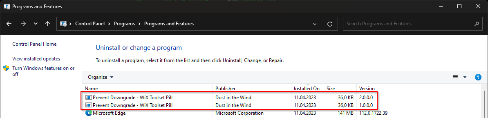

# Prevent Downgrade

When the `Product Code`, `Product Version` and `Package Code` are different, this is interpreted as a major upgrade or downgrade.

Furthermore, if the version number of the product is lower than the already installed one, this is considered a downgrade, and:

- If the `/Wix/Product/MajorUpgrade@AllowDowngrades` attribute is `no` or missing (default)
  - => the installation will not continue.

        - If the `/Wix/Product/MajorUpgrade@AllowDowngrades` attribute is `yes`
            - => the installation is allowed to continue.
    

## 1) Allow Downgrade (Major Upgrade is allowed)

> **Note**
>
> The major upgrade is inevitably activated if the downgrade support is desired.

To activate the downgrade support, add the `/Wix/Product/MajorUpgrade@AllowDowngrades` attribute in the MSI containing the lower version, the one that is installed at downgrade.

The MSI containing the higher version does not influence the downgrade support in any way.

```xml
<Wix xmlns="http://schemas.microsoft.com/wix/2006/wi">

    <Product ...>
        <MajorUpgrade AllowDowngrades="yes" />
    </Product>

</Wix>
```

### Result

When installing this MSI, the old version is uninstalled and the new version is installed in its place.

## 2) Prevent Downgrade (Major Upgrade is allowed)

> **Note**
>
> The major upgrade is inevitably activated if the downgrade support disabled.

To prevent the downgrade, add the `/Wix/Product/MajorUpgrade@DowngradeErrorMessage` attribute in the MSI containing the lower version, the one that is installed at downgrade. The `AllowDowngrades` attribute is automatically considered `no`.

The MSI containing the higher version does not influence the downgrade support in any way.

```xml
<Wix xmlns="http://schemas.microsoft.com/wix/2006/wi">

    <Product ...>
        <MajorUpgrade DowngradeErrorMessage="A newer version of [ProductName] is already installed." />
    </Product>

</Wix>
```

### Result

When attempting to install this MSI, an error message is displayed and the installer stops its execution.


## 3) Prevent Major Upgrade

In this case, makes no sense to talk about downgrade support anymore.

To prevent major upgrade, remove the `/Wix/Product/MajorUpgrade` tag from the MSI.

```xml
<Wix xmlns="http://schemas.microsoft.com/wix/2006/wi">

    <Product ...>

    </Product>

</Wix>
```

### Result

When install this MSI, the product will be installed alongside the existing version.

The existing version is not removed.


